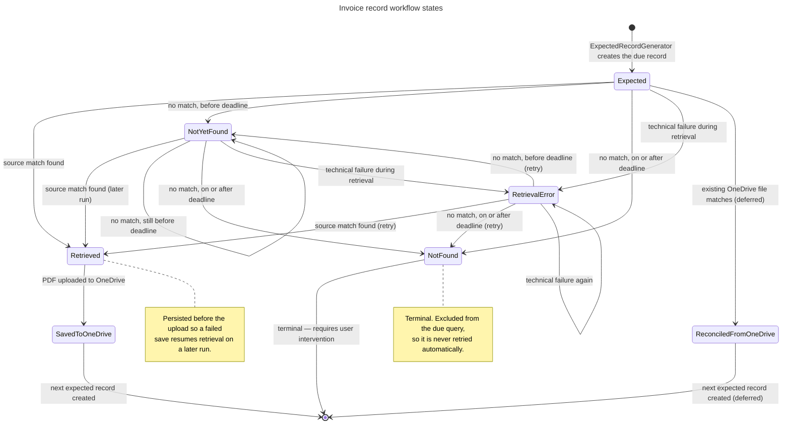

```mermaid
---
title: Invoice record workflow states
---
stateDiagram-v2
    %% States mirror the InvoiceWorkflowState union in
    %% src/InvoiceManager.Core/InvoiceWorkflowState.cs. Transitions are driven by
    %% DueInvoiceProcessor. Deadline = expectedDate + dateToleranceDays.

    [*] --> Expected : ExpectedRecordGenerator creates the due record

    %% --- Retrieval attempt (Expected / NotYetFound / RetrievalError are all "due") ---
    Expected --> Retrieved : source match found
    Expected --> NotYetFound : no match, before deadline
    Expected --> NotFound : no match, on or after deadline
    Expected --> RetrievalError : technical failure during retrieval

    NotYetFound --> Retrieved : source match found (later run)
    NotYetFound --> NotYetFound : no match, still before deadline
    NotYetFound --> NotFound : no match, on or after deadline
    NotYetFound --> RetrievalError : technical failure during retrieval

    %% RetrievalError is always retried, with no retry limit.
    RetrievalError --> Retrieved : source match found (retry)
    RetrievalError --> NotYetFound : no match, before deadline (retry)
    RetrievalError --> NotFound : no match, on or after deadline (retry)
    RetrievalError --> RetrievalError : technical failure again

    %% --- Save path ---
    Retrieved --> SavedToOneDrive : PDF uploaded to OneDrive

    %% --- OneDrive reconciliation (deferred: issue #11) ---
    Expected --> ReconciledFromOneDrive : existing OneDrive file matches (deferred)

    %% --- Terminal states ---
    SavedToOneDrive --> [*] : next expected record created
    ReconciledFromOneDrive --> [*] : next expected record created (deferred)
    NotFound --> [*] : terminal — requires user intervention

    note right of NotFound
        Terminal. Excluded from the due query,
        so it is never retried automatically.
    end note

    note right of Retrieved
        Persisted before the upload so a failed
        save resumes retrieval on a later run.
    end note
```