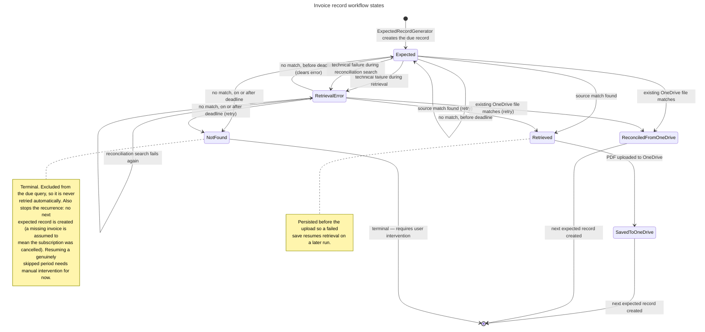

```mermaid
---
title: Invoice record workflow states
---
stateDiagram-v2
    %% States mirror the InvoiceWorkflowState union in
    %% src/InvoiceManager.Core/InvoiceWorkflowState.cs. Transitions are driven by
    %% DueInvoiceProcessor. Deadline = expectedDate + dateToleranceDays.

    [*] --> Expected : ExpectedRecordGenerator creates the due record

    %% --- Retrieval attempt (Expected / RetrievalError are both "due") ---
    %% Expected covers "not yet attempted" and "attempted, no match yet, in window".
    Expected --> Retrieved : source match found
    Expected --> Expected : no match, before deadline
    Expected --> NotFound : no match, on or after deadline
    Expected --> RetrievalError : technical failure during retrieval

    %% RetrievalError is always retried, with no retry limit.
    RetrievalError --> Retrieved : source match found (retry)
    RetrievalError --> Expected : no match, before deadline (clears error)
    RetrievalError --> NotFound : no match, on or after deadline (retry)
    RetrievalError --> RetrievalError : technical failure again

    %% --- Save path ---
    Retrieved --> SavedToOneDrive : PDF uploaded to OneDrive

    %% --- OneDrive reconciliation (checked before the source, for each due record) ---
    Expected --> ReconciledFromOneDrive : existing OneDrive file matches
    RetrievalError --> ReconciledFromOneDrive : existing OneDrive file matches (retry)
    Expected --> RetrievalError : technical failure during reconciliation search
    RetrievalError --> RetrievalError : reconciliation search fails again

    %% --- Terminal states ---
    SavedToOneDrive --> [*] : next expected record created
    ReconciledFromOneDrive --> [*] : next expected record created
    NotFound --> [*] : terminal — requires user intervention

    note right of NotFound
        Terminal. Excluded from the due query, so it is never
        retried automatically. Also stops the recurrence: no next
        expected record is created (a missing invoice is assumed to
        mean the subscription was cancelled). Resuming a genuinely
        skipped period needs manual intervention for now.
    end note

    note right of Retrieved
        Persisted before the upload so a failed
        save resumes retrieval on a later run.
    end note
```